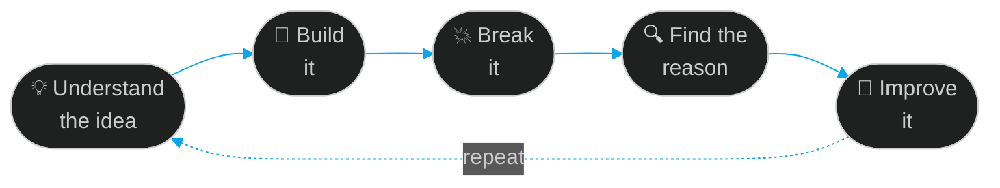

<div align="center">

<a href="https://github.com/Rahul-g-7">
  
</a>

<a href="https://github.com/Rahul-g-7">
  
</a>

<br/>


</div>

<br/>

---

<div align="center">

## `> whoami`

</div>

<table>
<tr>
<td width="55%" valign="top">

### 👋 Hey, I'm Rahul

I'm a third-year **B.E. Computer Science and Business Systems** student at **JSS Science and Technology University, Mysuru**.

I'm fascinated by the engineering *behind* modern software: how products are designed, how backends talk to each other, how systems scale under pressure, and how AI can become a genuinely useful part of real applications.

I don't stop at tutorials. My loop is simple:

> **understand the idea → build it → break it → find the reason → improve it.**

That last part, *find the reason*, is where the real learning lives.

</td>
<td width="45%" valign="top">

```yaml
name:        Rahul G
role:        Full-Stack Developer
university:  JSS STU, Mysuru
degree:      B.E. CSBS (3rd year)
location:    Mysuru, India 🇮🇳

focus:
  - Backend
  - Systems
  - AI

exploring:
  - System Design
  - Agentic AI
  - DevOps

mindset: |
  Learn → Build → Break
  → Understand → Improve

status:      building with intent ⚡
```

</td>
</tr>
</table>

<br/>

---

<div align="center">

## ⚡ What I'm Focused On

</div>

<table>
<tr>
<td align="center" width="33%" valign="top">

### 🧱 Software Engineering

Backend development, APIs, databases, and architecture, plus writing software that stays **understandable as it grows**.


</td>
<td align="center" width="33%" valign="top">

### 🧠 AI Engineering

LLM applications, agentic workflows, and intelligent systems that solve **practical problems**, not just demos.


</td>
<td align="center" width="33%" valign="top">

### 🏗️ Systems & Infrastructure

System design, scalability, distributed systems, containers, and the decisions behind **reliable software**.


</td>
</tr>
</table>

<br/>

---

<div align="center">

## 🛠️ Toolkit


<br/>


<br/><br/>


</div>

<br/>

---

<div align="center">

## 🔁 How I Learn

</div>



<br/>

---

<div align="center">

## 🧭 Engineering Principles

</div>

<table>
<tr>
<td width="50%" valign="top">

**🧩 Fundamentals first**
Frameworks change. Data structures, networks, and operating systems don't.

**🔬 Understand *why*, not just *how***
If I can't explain why it works, I don't understand it yet.

</td>
<td width="50%" valign="top">

**🧼 Clarity over cleverness**
Code is read far more than it's written. Future-me is a stakeholder.

**🧪 Learn by breaking things**
Failure modes teach more than happy paths ever will.

</td>
</tr>
</table>

<br/>

---

<div align="center">

## 🌱 Currently Levelling Up

<table>
<tr>
<td align="center">

```text
System Design       ██████████░░░░░░░░░░  in progress
Agentic AI          ████████████░░░░░░░░  in progress
DevOps & Docker     ██████████░░░░░░░░░░  in progress
Backend Depth       ██████████████░░░░░░  in progress
```

</td>
</tr>
</table>

</div>

<br/>

---

<div align="center">

## 📊 GitHub, By The Numbers

<!-- Live stats cards (cache_seconds keeps them refreshing; count_private removed as it only works when self-hosted) -->


<br/><br/>

<!-- Contribution snake: generated by .github/workflows/snake.yml (pushes to the "output" branch) -->


<br/><br/>

<!-- Self-generated metrics: created by .github/workflows/metrics.yml (needs METRICS_TOKEN secret).
     This image stays broken until the workflow has run once. Delete this block if you skip that workflow. -->


</div>

<br/>

---

<div align="center">

## 🏆 Trophy Shelf


</div>

<br/>

---

<div align="center">

## 💬 Philosophy


I care about **fundamentals**, **clean thinking**, **practical experimentation**, and **continuous improvement**.

The goal: become the kind of engineer who can take an idea from concept to architecture to implementation to deployment, and understand every layer in between.

<br/>

### `Software  ×  Systems  ×  AI`

*Learning every day. Building with intent. Staying curious.*

<br/>

<a href="https://github.com/Rahul-g-7">
  
</a>

<br/><br/>


</div>
